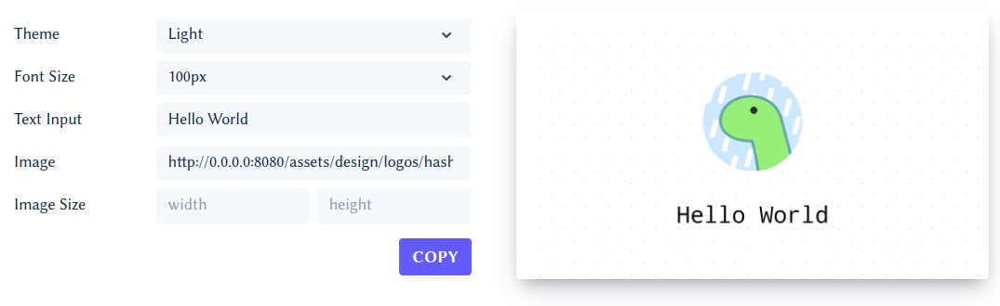

# portrait

Portrait is a service, written in Deno, that generates dynamic
[Open Graph](http://ogp.me) images that you can embed in your `meta` tags. Try
it out on [Zaubrik](https://dev.zaubrik.com/portrait/) for free.

## What is this?


This is a service that for each keystroke generates customized dynamic
 images that you can embed in your <code>meta</code> tags.
Lots of services like Twitter, Discord and LinkedIn can render the specified
image to make your link stand out from the rest!

## How does it work?

In short, what this service does, is take in a request through its REST API,
generate an
[HTML Canvas](https://developer.mozilla.org/en-US/docs/Web/API/Canvas_API) using
the provided variables and respond with an image having the appropriate image
properties and headers. Try it out and deploy your own image generator on
[Deno](https://deno.land/).

## Todo

- More features
- Some browser tests
- Add markdown's **bold** and _italic_ syntax to the text input.

  - Idea:
    [ctx.measureText](https://developer.mozilla.org/en-US/docs/Web/API/CanvasRenderingContext2D/measureText)
    from the Canvas API and RegExp?

  ```ts
  const regexBold = /\*\*([^*]*)\*\*/g;
  const regexItalic = /\*([^*]*)\*/g;

  function parse(regExp: RegExp) {
    return (str: string) => {
      return [...str.matchAll(regExp)];
    };
  }

  const parseBold = parse(regexBold);
  const parseItalic = parse(regexItalic);

  let r1 = parseBold("aaa bb**ff**ccc,c**cc d**dd");
  ```
